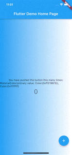

# flutter_gradient_colors_not_work

A problem of not refreshing.
一个不刷新的问题。



### Happened

```
Flutter 3.3.6 • channel stable • https://github.com/flutter/flutter.git
Framework • revision 6928314d50 (4 weeks ago) • 2022-10-25 16:34:41 -0400
Engine • revision 3ad69d7be3
Tools • Dart 2.18.2 • DevTools 2.15.0
```

I try to change the color of the Gradient dynamically, but when only one data is updated, the data is updated, but the interface is not updated.
我试图通过动态的改变Gradient的颜色，但是仅更新一个数据的时候，数据被更新了，界面却没有被更新。

[ISSUES-115929](https://github.com/flutter/flutter/issues/115929)

### How to solve.
